# Third Iron Primo NDE Add-On

- [Using the Add-On](#using-the-third-iron-primo-nde-add-on)
- [View Options](#view-options)
- [Custom Labels and Translation](#custom-labels-and-translation)
- [Developer Notes](#developer-notes)
- [Resources](#additional-resources)

## Overview

The NDE Customization package offers options to enhance and extend the functionality of Primo’s New Discovery Experience (NDE). This Third Iron Add-On adds LibKey support directly into the Primo NDE experience.

The NDE UI supports loading of custom modules at runtime and also provides infrastructure to dynamically load add-ons developed by vendors, consortia, or community members. This enables seamless integration, allowing institutions to configure and deploy external add-ons through **Add-On Configuration in Alma**.

The NDE UI add-on framework allows various stakeholders to develop and integrate custom functionality:

- **Vendors** can create and host services that institutions can seamlessly incorporate into their environment.
- **Institutions and consortia** can develop and share custom components, enabling consistency and collaboration across multiple libraries.

Library staff can easily add, configure, and manage these add-ons through Alma, following guidelines provided by the stakeholders. These typically include:

- **Add-on Name** – The identifier used in Alma’s configuration.
- **Add-on URL** – The location where the add-on is hosted (static folder to load the add-on at runtime).
- **Configuration Parameters** – JSON-based config parameters to be referenced at runtime by the add-on.


## Prerequisites

**Note:**
The NDE Customization package is currently available exclusively to Primo customers who have early access to the New Discovery Experience (NDE). Further availability will be announced in upcoming releases.

## Using the Third Iron Primo NDE Add-On

### Step 1: Create NDE view in Alma (if not present)

1. In Alma, navigate to **Discovery > Configure Views**

   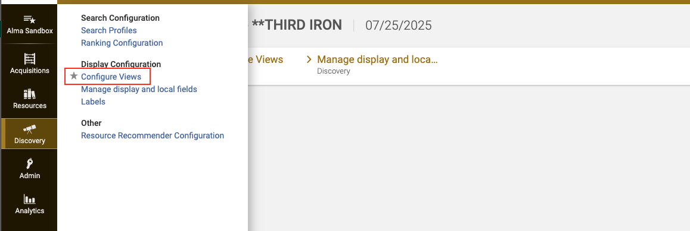

2. On the View List screen, select "Add View"

   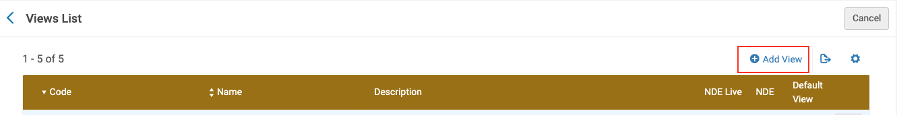

3. Configure the view as needed, making sure to check the NDE checkbox

   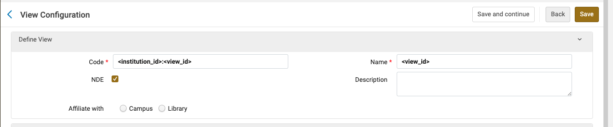

### Step 2: Update the default configuration file

Fill in your LibKey **Library ID** and **API Key**, along with your **Unpaywall Email Address**. Update the other boolean configuration values as needed.

Default configuration JSON:

```
  {
    "apiKey": "your-libkey-api-key",
    "libraryId": "your-libkey-library-id",
    "viewOption": "stack-plus-browzine",
    "unpaywallEmailAddressKey": "your-unpaywall-email-address",
    "journalCoverImagesEnabled": "true",
    "journalBrowZineWebLinkTextEnabled": "true",
    "articleBrowZineWebLinkTextEnabled": "true",
    "articlePDFDownloadLinkEnabled": "true",
    "articleLinkEnabled": "true",
    "printRecordsIntegrationEnabled": "true",
    "showFormatChoice": "false",
    "showLinkResolverLink": "true",
    "enableLinkOptimizer": "true",
    "articleRetractionWatchEnabled": "true",
    "articleExpressionOfConcernEnabled": "true",
    "articlePDFDownloadViaUnpaywallEnabled": "true",
    "articleLinkViaUnpaywallEnabled": "true",
    "articleAcceptedManuscriptPDFViaUnpaywallEnabled": "true",
    "articleAcceptedManuscriptArticleLinkViaUnpaywallEnabled": "true"
  }
```

### Step 3: Setup Add-On configuration in Alma

1. In Alma, navigate to the "Configuration" section

   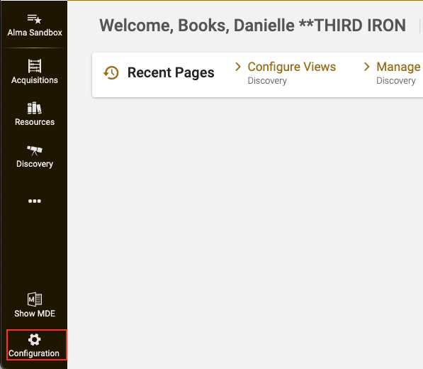

2. Then go to **Discovery > Add-on Configuration**

   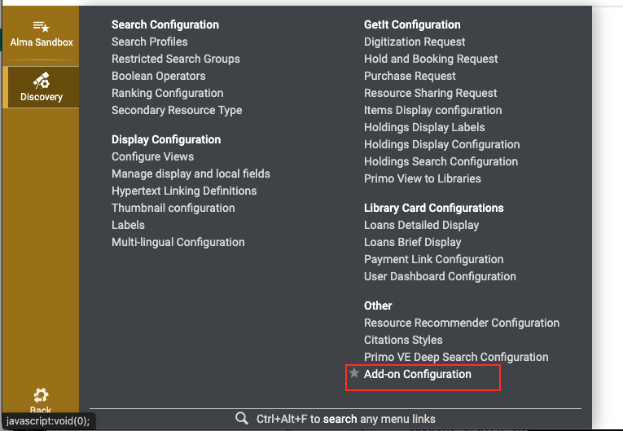

   Configure the following:
   - **Add-on Name** – The identifier used in Alma’s configuration (View ID set in step 1).
   - **Add-on URL** – The location where the add-on is hosted (static folder to load the add-on at runtime). The current URL for the LibKey add-on is `https://discovery-adapters.thirdiron.com/primo-nde/production` (keep the trailing '/')
   - **Add-on Configuration File** – JSON-based config parameters to be referenced at runtime by the add-on. Upload your modified JSON configuration file from Step 2.

## View Options

We provide three basic view options that effect the LibKey button arrangement:

1. "Stack + BrowZine Link"

   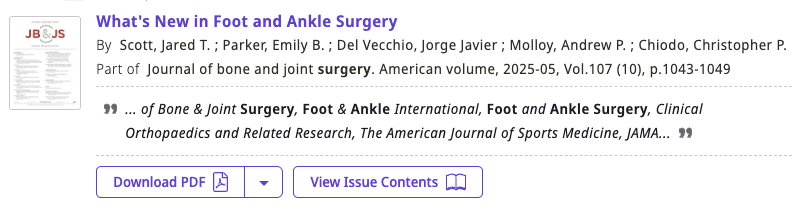

   This version fully embraces the new “Stack” concept of link minimization in NDE by putting the “one click” link front and center with additional linking options available in the drop down arrow. LibKey Links would take precedent over Alma QuickLinks whenever they may both exist. The BrowZine View Issue Contents link appears separate since it serves a different purpose then immediate content access.

   _Set in the config JSON file with:` "viewOption:"stack-plus-browzine"`_

2. "Single Stack"

   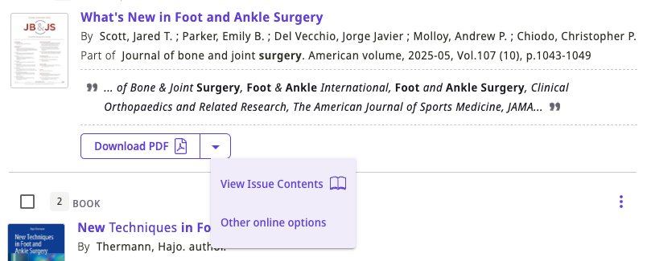

   This version puts all LibKey and Alma generated links under a single stack. Effectively the only difference between this and the above option is that the BrowZine View Issue Contents appears with the links to content.

   _Set in the config JSON file with:` "viewOption:"single-stack"`_

3. "No Stack"

   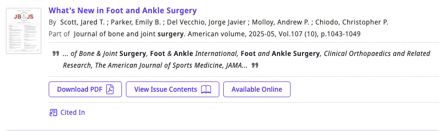

   With this arrangement we recommend turning off the link resolver when LibKey can create links as leaving it on can result in duplicate linking since Alma will generate a “stack” of links via a drop down menu off to the right which could be confusing.

   _Set in the config JSON file with:` "viewOption:"no-stack"`_

## Custom Labels and Translation

Button label text can be customized and translated by setting up label codes in the Alma database. This can be done manually in a one-by-one way for each label, or en masse by importing a file with multiple labels with their corresponding custom text and translation values.

### Manual entry

1. In Alma, navigate to Discovery > Labels

   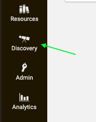

   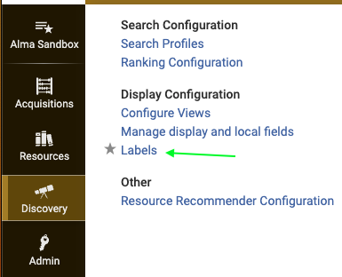

2. find "View Labels" table and click the hamburger menu on the right to find the "edit" option. Then click "Add Row"

   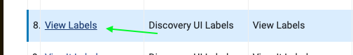

   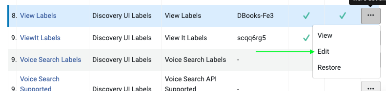

   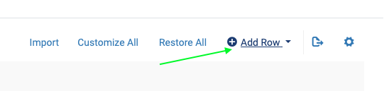

3. The available label codes are as follows:
   - LibKey.articleRetractionWatchText
   - LibKey.articleExpressionOfConcernText
   - LibKey.articlePDFDownloadLinkText
   - LibKey.articleLinkText
   - LibKey.documentDeliveryFulfillmentText
   - LibKey.articlePDFDownloadViaUnpaywallText
   - LibKey.articleLinkViaUnpaywallText
   - LibKey.articleAcceptedManuscriptPDFViaUnpaywallText
   - LibKey.articleAcceptedManuscriptArticleLinkViaUnpaywallText
   - LibKey.journalBrowZineWebLinkText
   - LibKey.articleBrowZineWebLinkText

   Enter one of the above code values in the "Code" field with the English label in the "Description" field

   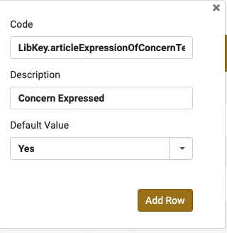

4. To add a translation for different languages, select the language in the Filter top section of the View Labels table view, then add the desired translation string to the "Translation" column for the given label Code.

   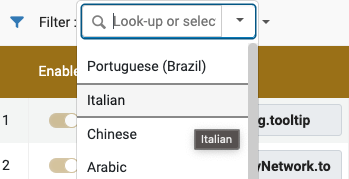

   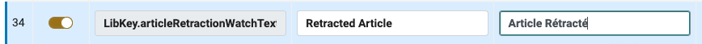

## Developer notes

### Debug mode

This add-on supports a **runtime-toggleable debug mode**. When enabled, the add-on will emit structured log messages to the browser console at key points in the app flow (API calls, decision points, DOM removal, etc.).

To add a debug message, make sure to inject the debugLog service, then construct your log message as follows, keeping the convention of
`Component.FunctionName.descriptionRelevantToLoggedData`:

```
import { DebugLogService } from './debug-log.service';
...
constructor(
    private debugLog: DebugLogService
  ) {}
...
this.debugLog.debug('Navigation.openUrl.resolvedTarget', {
      url: this.debugLog.redactUrlTokens(url),
      resolvedTarget,
});
```

**Console API**

- Enable: `window.__TI_NDE__.debug.enable()`
- Disable: `window.__TI_NDE__.debug.disable()`
- Toggle: `window.__TI_NDE__.debug.toggle()`
- Check: `window.__TI_NDE__.debug.isEnabled()`
- Help: `window.__TI_NDE__.debug.help()`

**Persistence**

Debug mode persists across reloads via `localStorage` key `__TI_NDE_DEBUG__`:

- Force ON: `localStorage.setItem('__TI_NDE_DEBUG__', '1')`
- Force OFF: `localStorage.setItem('__TI_NDE_DEBUG__', '0')`
- Clear: `localStorage.removeItem('__TI_NDE_DEBUG__')`

Generally you can just use the functions described above in the Console API, but if you wanted to set the localStorage value directly you can in this way.

Once the localStorage value is set to true, either directly or via the exposed functions, log statements will be emitted to the browser console on the next action that would trigger a log message.

**Redaction policy**

- Never log API keys, `access_token` values, or full PNX/record payloads.
- Logs should contain small identifiers/booleans and other non-sensitive metadata.

**Simple flow**

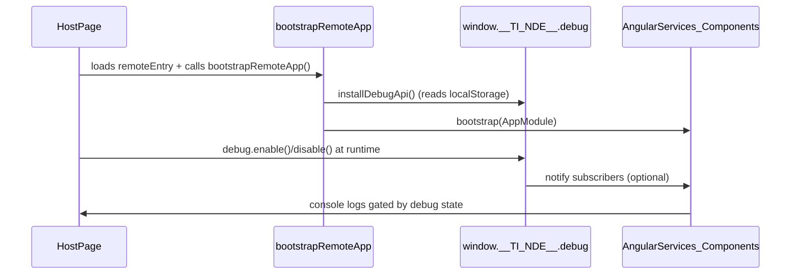

### Sync the forked repo

1. Verify existing remotes by running: `git remote -v`. You should see an `origin` remote pointing to your fork on GitHub.
2. Add the original repository as the 'upstream' remote (if you haven't already).
   Specify the URL of the original repository forked.
   ```
   git remote add upstream https://github.com/ExLibrisGroup/customModule.git
   ```
   You can then run git remote -v again to confirm the new upstream remote.
3. Fetch the changes from the upstream repository:
   ```
   git fetch upstream
   ```
4. Switch to your local default branch (develop):
   ```
   git checkout develop
   ```
5. Merge the changes from the upstream default branch into your local branch:
   ```
   git merge upstream/main
   ```
   If there are merge conflicts, you will need to resolve them in your local files and commit the changes.
6. Push the updated local branch to your fork (the `origin` remote):
   ```
   git push origin develop
   ```

### Adding new icons

1. To add new icons, bring in the .svg file into `/src/assets/icons`. Edit the svg file to have a `color` prop that is dynamically set (see the other svg files for examples).
2. a new icon component needs to be created in `/src/app/components/icons` and imported in `svg-icon.component.ts`.
3. A new case for the switch statement in the svg-icon component template file `svg-icon.component.html` also needs to be added.
4. Also, for icon positioning, make sure to add a class to the svg-icon component's style file (`svg-icon.component.scss`) specific to the new icon or extend existing style classes.

### Environment Variables

The following environment variables are used in CircleCI:

AWS Deployment

- `AWS_ACCESS_KEY` : value stored in keepass
- `AWS_ACCESS_KEY_ID` : value stored in keepass
- `AWS_BUCKET` : thirdiron-adapters
- `AWS_DEFAULT_REGION` : us-east-1
- `AWS_SECRET_ACCESS_KEY` : value stored in keepass

Release Notes Generator

- `RENOGEN_GITHUB_OAUTH_TOKEN` : value stored in keepass

## Primo LibKey Add-on Architecture Sequence Diagram

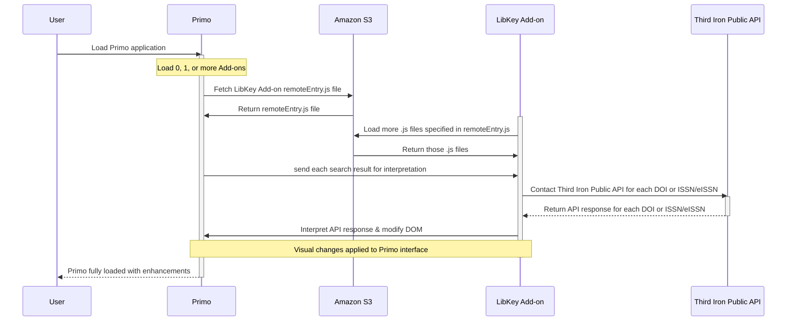

## Additional Resources

### Live Demo Tutorial

- **Customize Primo NDE UI**: Watch the ExLibris live demo on YouTube for a visual guide on how to customize the Primo NDE UI:
  [Customize Primo NDE UI: Live Demo](https://www.youtube.com/watch?v=z06l2hJYuLc)

### Customer Documentaion for Third Iron Add-On

Our customer facing documentation for getting up and running with this Primo NDE add-on can be found [in our confluence docs](https://thirdiron.atlassian.net/wiki/spaces/BrowZineAPIDocs/pages/4018733059/Ex+Libris+Primo+NDE+Beta).
