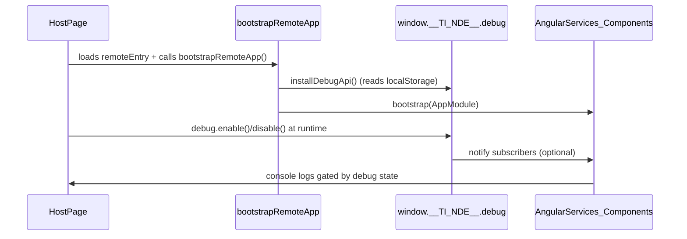
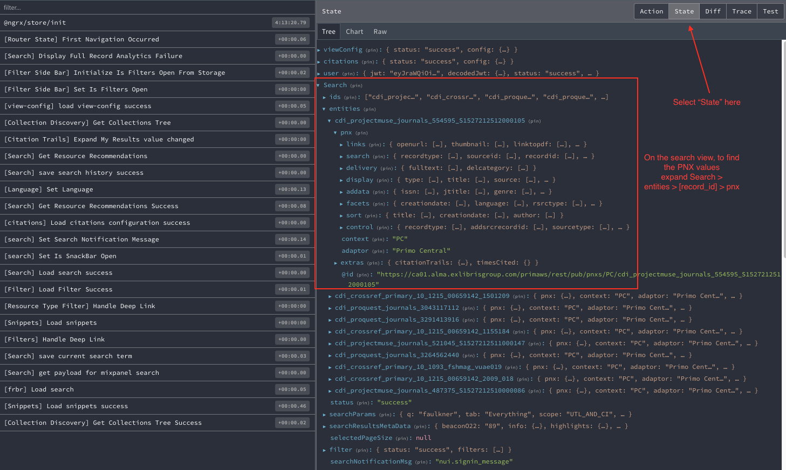
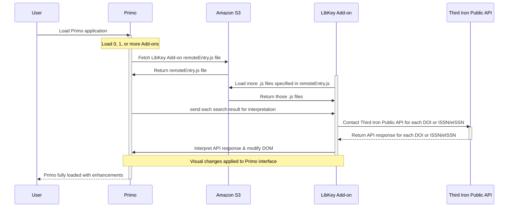

# Third Iron Primo NDE Add-On

## Customer Documentation for Third Iron Add-On

Our customer facing documentation for getting up and running with this Primo NDE add-on can be found [in our confluence docs](https://thirdiron.atlassian.net/wiki/spaces/BrowZineAPIDocs/pages/4018733059/Ex+Libris+Primo+NDE+Beta). This README is targeted mostly for advanced users who may be adding additional customization to their add-on or for Third Iron internal developers. If you are a customer who will be integrating the Third Iron LibKey add-on in a standard way, please refer to the documentation in the link above.

## Getting started

This repo is the **Third Iron LibKey add-on for Ex Libris Primo NDE**. It is an Angular microfrontend (module federation) that Primo loads at runtime. The add-on reads Primo search-result data, calls the Third Iron Public API, and renders LibKey/BrowZine buttons and journal covers in the Primo UI.

### Prerequisites

- Node.js and npm (Angular 18 project)
- Git

### First-time setup

1. Clone the repo and install dependencies:
   ```bash
   npm install
   ```
2. Review `build-settings.env` at the repo root. This file drives the add-on name and asset base URL used during build. The checked-in defaults are:
   - `ADDON_NAME=LibKey`
   - `INST_ID` / `VIEW_ID` for local/proxy configuration
3. Run a build or start command once so `prebuild.js` can generate/update bootstrap and asset config files.

### Run against Primo Sandbox account (recommended for full testing)

Changes are pushed up to the '/dev-test/' S3 bucket when the feature branch CI pipeline runs. You can then point the Alma backend config Add-On URL to the '/dev-test/' URL for end-to-end testing (with our config loaded).

### Run locally

- **Standalone dev server** (useful for unit work and quick UI checks):

  ```bash
  npm start
  ```

  Serves on port `4201`.

- **Against a Primo instance** (end-to-end behavior):
  ```bash
  npm run start:proxy
  ```
  Uses `proxy/proxy.conf.mjs` to proxy Primo and inject local add-on assets. Set the target Primo environment in `proxy/proxy.const.mjs` (`PROXY_TARGET`).
  Note: the drawback of this proxied testing is that all our config values are not loaded. You can hardcode defaults, or just push up a build to the /dev-test S3 directory (described in [CircleCI deployment targets](#circleci-deployment-targets)) and point the Alma backend Add-On url to the /dev-test directory.

### Test and build

```bash
npm test          # unit tests (Karma/Jasmine)
npm run test:ci   # headless CI-style test run
npm run build     # production build to dist/
```

### Where to start in the code

| Area                   | Location                                               | What it does                                         |
| ---------------------- | ------------------------------------------------------ | ---------------------------------------------------- |
| Primo entry point      | `src/bootstrapLibKey.ts`                               | Bootstraps the remote microfrontend                  |
| Component registration | `src/app/third-iron-module/customComponentMappings.ts` | Maps Primo DOM slots to Angular components           |
| Main UI                | `src/app/third-iron-module/third-iron-buttons/`        | Renders LibKey buttons on search results and records |
| Button logic           | `src/app/services/button-info.service.ts`              | Calls TI API and runs the display waterfall          |
| Config flags           | `src/app/services/config.service.ts`                   | Reads add-on module parameters from Primo            |
| Local proxy setup      | `proxy/`                                               | Primo proxy rules and customization overrides        |

For runtime troubleshooting, enable debug mode in the browser console (`window.__TI_NDE__.debug.enable()`). See [Debug mode](#debug-mode) below.

### What to read next

- [Developer notes](#developer-notes) for debugging, syncing the upstream fork, icons, and Redux/pnx inspection
- [Primo LibKey Add-on Architecture](#primo-libkey-add-on-architecture-sequence-diagram) for the high-level runtime flow
- [S3_DEPLOYMENT_GUIDE.md](S3_DEPLOYMENT_GUIDE.md) and [CircleCI deployment targets](#circleci-deployment-targets) for release paths

## README Outline

- [Getting started](#getting-started)
- [Developer Notes](#developer-notes)
- [Resources](#additional-resources)

## Developer notes

### Debug mode

This add-on supports a **runtime-toggleable debug mode**. When enabled, the add-on will emit structured log messages to the browser console at key points in the app flow (API calls, decision points, DOM removal, etc.).

To add a debug message, make sure to inject the debugLog service, then construct your log message as follows, keeping the convention of
`Component.FunctionName.descriptionRelevantToLoggedData`:

```
import { DebugLogService } from './debug-log.service';
...
constructor(
    private debugLog: DebugLogService
  ) {}
...
this.debugLog.debug('Navigation.openUrl.resolvedTarget', {
      url: this.debugLog.redactUrlTokens(url),
      resolvedTarget,
});
```

**Console API**

- Enable: `window.__TI_NDE__.debug.enable()`
- Disable: `window.__TI_NDE__.debug.disable()`
- Toggle: `window.__TI_NDE__.debug.toggle()`
- Check: `window.__TI_NDE__.debug.isEnabled()`
- Help: `window.__TI_NDE__.debug.help()`

**Persistence**

Debug mode persists across reloads via `localStorage` key `__TI_NDE_DEBUG__`:

- Force ON: `localStorage.setItem('__TI_NDE_DEBUG__', '1')`
- Force OFF: `localStorage.setItem('__TI_NDE_DEBUG__', '0')`
- Clear: `localStorage.removeItem('__TI_NDE_DEBUG__')`

Generally you can just use the functions described above in the Console API, but if you wanted to set the localStorage value directly you can in this way.

Once the localStorage value is set to true, either directly or via the exposed functions, log statements will be emitted to the browser console on the next action that would trigger a log message.

**Redaction policy**

- Never log API keys, `access_token` values, or full PNX/record payloads.
- Logs should contain small identifiers/booleans and other non-sensitive metadata.

**Simple flow**


```mermaid
sequenceDiagram
participant HostPage
participant RemoteBootstrap as bootstrapRemoteApp
participant DebugApi as window.__TI_NDE__.debug
participant App as AngularServices_Components

HostPage->>RemoteBootstrap: loads remoteEntry + calls bootstrapRemoteApp()
RemoteBootstrap->>DebugApi: installDebugApi() (reads localStorage)
RemoteBootstrap->>App: bootstrap(AppModule)
HostPage->>DebugApi: debug.enable()/disable() at runtime
DebugApi->>App: notify subscribers (optional)
App->>HostPage: console logs gated by debug state
```

### Sync the forked repo

1. Verify existing remotes by running: `git remote -v`. You should see an `origin` remote pointing to your fork on GitHub.
2. Add the original repository as the 'upstream' remote (if you haven't already).
   Specify the URL of the original repository forked.
   ```
   git remote add upstream https://github.com/ExLibrisGroup/customModule.git
   ```
   You can then run git remote -v again to confirm the new upstream remote.
3. Fetch the changes from the upstream repository:
   ```
   git fetch upstream
   ```
4. Switch to your local default branch (develop):
   ```
   git checkout develop
   ```
5. Merge the changes from the upstream default branch into your local branch:
   ```
   git merge upstream/main
   ```
   If there are merge conflicts, you will need to resolve them in your local files and commit the changes.
6. Push the updated local branch to your fork (the `origin` remote):
   ```
   git push origin develop
   ```

### Adding new icons

1. To add new icons, bring in the .svg file into `/src/assets/icons`. Edit the svg file to have a `color` prop that is dynamically set (see the other svg files for examples).
2. a new icon component needs to be created in `/src/app/components/icons` and imported in `svg-icon.component.ts`.
3. A new case for the switch statement in the svg-icon component template file `svg-icon.component.html` also needs to be added.
4. Also, for icon positioning, make sure to add a class to the svg-icon component's style file (`svg-icon.component.scss`) specific to the new icon or extend existing style classes.

### Examining individual search result data (pnx data)

Primo NDE uses Redux to manage the state of search results or single items displayed onscreen, so for us to examine everything in there, it's highly recommended to use the [Redux DevTools browser extension](https://chromewebstore.google.com/detail/redux-devtools/lmhkpmbekcpmknklioeibfkpmmfibljd?hl=en).

Once it's installed, to see the various pnx items:

1. Probably turn on debug mode to see data the Add-on is ingesting from the Primo pnx data
2. Open the Redux DevTools
3. Load a Primo NDE search result or single item
4. Click on "State" on the right side of the Redux DevTools, then "Tree" inside there
5. Expand the "Search" item - you'll now see each individual pnx record

- 

6. The ID like `cdi_projectmuse_journals_1234_S402391...` appears both in the visible DOM, and in the pnx data, so that's how you can associate what is displayed with what is in the Redux in-memory state

### Environment Variables

The following environment variables are used in CircleCI:

AWS Deployment

- `AWS_ACCESS_KEY` : value stored in keepass
- `AWS_ACCESS_KEY_ID` : value stored in keepass
- `AWS_BUCKET` : thirdiron-adapters
- `AWS_DEFAULT_REGION` : us-east-1
- `AWS_SECRET_ACCESS_KEY` : value stored in keepass

Release Notes Generator

- `RENOGEN_GITHUB_OAUTH_TOKEN` : value stored in keepass

### CircleCI deployment targets

The CircleCI workflow in `.circleci/config.yml` deploys build artifacts to different S3 prefixes based on branch name:

- `feature/*` branches run `deploy-to-dev-test` and sync to `s3://$AWS_BUCKET/primo-nde/dev-test`
- `develop` runs `deploy-to-staging` and syncs to `s3://$AWS_BUCKET/primo-nde/staging`
- `main` runs `deploy-to-production` and syncs to `s3://$AWS_BUCKET/primo-nde/production`

For feature-branch testing, configure your Add-on URL to point at the `dev-test` path while validating branch changes.

## Primo LibKey Add-on Architecture Sequence Diagram


```mermaid
sequenceDiagram
    participant User
    participant Primo
    participant AWSS3 as Amazon S3
    participant LibKey as LibKey Add-on
    participant API as Third Iron Public API

    User->>Primo: Load Primo application
    activate Primo

    Note over Primo: Load 0, 1, or more Add-ons

    Primo->>AWSS3: Fetch LibKey Add-on remoteEntry.js file
    AWSS3->>Primo: Return remoteEntry.js file
    activate LibKey

    LibKey->>AWSS3: Load more .js files specified in remoteEntry.js
    AWSS3->>LibKey: Return those .js files

    Primo->>LibKey: send each search result for interpretation

    LibKey->>API: Contact Third Iron Public API for each DOI or ISSN/eISSN
    activate API
    API-->>LibKey: Return API response for each DOI or ISSN/eISSN
    deactivate API

    LibKey->>Primo: Interpret API response & modify DOM
    Note over LibKey,Primo: Visual changes applied to Primo interface
    deactivate LibKey

    Primo-->>User: Primo fully loaded with enhancements
    deactivate Primo
```

## Additional Resources

### Live Demo Tutorial

- **Customize Primo NDE UI**: Watch the ExLibris live demo on YouTube for a visual guide on how to customize the Primo NDE UI:
  [Customize Primo NDE UI: Live Demo](https://www.youtube.com/watch?v=z06l2hJYuLc)
